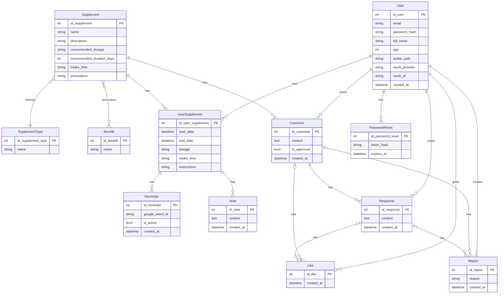

# Vitam-in

## MCD

```mermaid
erDiagram
    User {
        int id_user PK
        string email
        string password_hash
        string full_name
        int age
        string avatar_path
        string oauth_provider
        string oauth_id
        datetime created_at
    }

    SupplementType {
        int id_supplement_type PK
        string name
    }

    Supplement {
        int id_supplement PK
        string name
        string description
        string recommended_dosage
        int recommended_duration_days
        string intake_time
        string precautions
    }

    Benefit {
        int id_benefit PK
        string name
    }

    UserSupplement {
        int id_user_supplement PK
        datetime start_date
        datetime end_date
        string dosage
        string intake_time
        string instructions
    }

    Reminder {
        int id_reminder PK
        string google_event_id
        bool is_active
        datetime created_at
    }

    Note {
        int id_note PK
        text content
        datetime created_at
    }

    Comment {
        int id_comment PK
        text content
        bool is_approved
        datetime created_at
    }

    Response {
        int id_response PK
        text content
        datetime created_at
    }

    Like {
        int id_like PK
        datetime created_at
    }

    Report {
        int id_report PK
        string reason
        datetime created_at
    }

    PasswordReset {
        int id_password_reset PK
        string token_hash
        datetime expires_at
    }

    User ||--o{ UserSupplement : "has"
    User ||--o{ Comment : "writes"
    User ||--o{ Response : "writes"
    User ||--o{ Like : "gives"
    User ||--o{ Report : "creates"
    User ||--o{ PasswordReset : "has"

    Supplement ||--o{ UserSupplement : "has"
    Supplement }o--o{ Benefit : "associated"
    Supplement ||--o{ Comment : "has"
    Supplement }o--|| SupplementType : "belongs"

    UserSupplement ||--o{ Note : "has"
    UserSupplement ||--o{ Reminder : "has"

    Comment ||--o{ Response : "has"
    Comment |o--o{ Like : "has"
    Comment |o--o{ Report : "has"

    Response |o--o{ Like : "has"
    Response |o--o{ Report : "has"
```