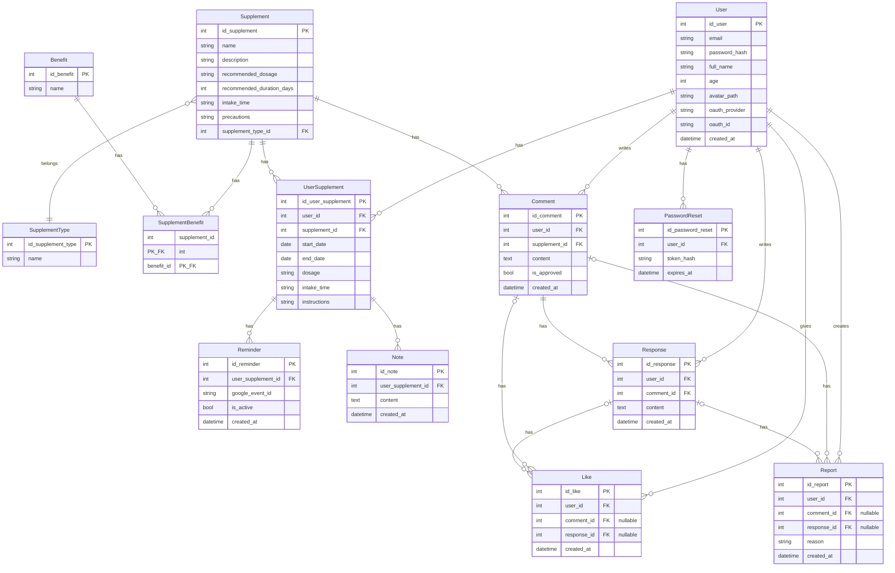

# Vitam-in

## MLD

```mermaid
erDiagram
    User {
        int id_user PK
        string email
        string password_hash
        string full_name
        int age
        string avatar_path
        string oauth_provider
        string oauth_id
        datetime created_at
    }

    SupplementType {
        int id_supplement_type PK
        string name
    }

    Supplement {
        int id_supplement PK
        string name
        string description
        string recommended_dosage
        int recommended_duration_days
        string intake_time
        string precautions
        int supplement_type_id FK
    }

    Benefit {
        int id_benefit PK
        string name
    }

    SupplementBenefit {
        int supplement_id PK_FK
        int benefit_id PK_FK
    }

    UserSupplement {
        int id_user_supplement PK
        int user_id FK
        int supplement_id FK
        date start_date
        date end_date
        string dosage
        string intake_time
        string instructions
    }

    Reminder {
        int id_reminder PK
        int user_supplement_id FK
        string google_event_id
        bool is_active
        datetime created_at
    }

    Note {
        int id_note PK
        int user_supplement_id FK
        text content
        datetime created_at
    }

    Comment {
        int id_comment PK
        int user_id FK
        int supplement_id FK
        text content
        bool is_approved
        datetime created_at
    }

    Response {
        int id_response PK
        int user_id FK
        int comment_id FK
        text content
        datetime created_at
    }

       Like {
        int id_like PK
        int user_id FK
        int comment_id FK "nullable"
        int response_id FK "nullable"
        datetime created_at
    }

    Report {
        int id_report PK
        int user_id FK
        int comment_id FK "nullable"
        int response_id FK "nullable"
        string reason
        datetime created_at
    }

    PasswordReset {
        int id_password_reset PK
        int user_id FK
        string token_hash
        datetime expires_at
    }

    User ||--o{ UserSupplement : has
    User ||--o{ Comment : writes
    User ||--o{ Response : writes
    User ||--o{ Like : gives
    User ||--o{ Report : creates
    User ||--o{ PasswordReset : has

    Supplement ||--o{ UserSupplement : has
    Supplement ||--o{ SupplementBenefit : has
    Supplement ||--o{ Comment : has
    Supplement }o--|| SupplementType : belongs

    Benefit ||--o{ SupplementBenefit : has

    UserSupplement ||--o{ Note : has
    UserSupplement ||--o{ Reminder : has

    Comment ||--o{ Response : has
    Comment |o--o{ Like : has
    Comment |o--o{ Report : has

    Response |o--o{ Like : has
    Response |o--o{ Report : has
```