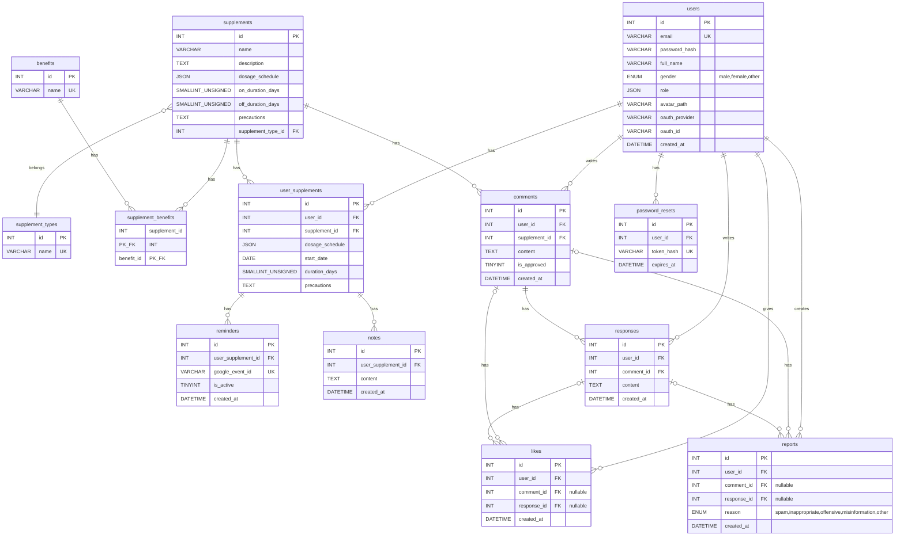

# Vitam-in

## MPD (Modèle Physique de Données)

```mermaid
erDiagram
    users {
        INT id PK
        VARCHAR email UK
        VARCHAR password_hash
        VARCHAR full_name
        ENUM gender "male,female,other"
        JSON role
        VARCHAR avatar_path
        VARCHAR oauth_provider
        VARCHAR oauth_id
        DATETIME created_at
    }

    supplement_types {
        INT id PK
        VARCHAR name UK
    }

    supplements {
        INT id PK
        VARCHAR name
        TEXT description
        JSON dosage_schedule
        SMALLINT_UNSIGNED on_duration_days
        SMALLINT_UNSIGNED off_duration_days
        TEXT precautions
        INT supplement_type_id FK
    }

    benefits {
        INT id PK
        VARCHAR name UK
    }

    supplement_benefits {
        INT supplement_id PK_FK
        INT benefit_id PK_FK
    }

    user_supplements {
        INT id PK
        INT user_id FK
        INT supplement_id FK
        JSON dosage_schedule
        DATE start_date
        SMALLINT_UNSIGNED duration_days
        TEXT precautions
    }

    reminders {
        INT id PK
        INT user_supplement_id FK
        VARCHAR google_event_id UK
        TINYINT is_active
        DATETIME created_at
    }

    notes {
        INT id PK
        INT user_supplement_id FK
        TEXT content
        DATETIME created_at
    }

    comments {
        INT id PK
        INT user_id FK
        INT supplement_id FK
        TEXT content
        TINYINT is_approved
        DATETIME created_at
    }

    responses {
        INT id PK
        INT user_id FK
        INT comment_id FK
        TEXT content
        DATETIME created_at
    }

    likes {
        INT id PK
        INT user_id FK
        INT comment_id FK "nullable"
        INT response_id FK "nullable"
        DATETIME created_at
    }

    reports {
        INT id PK
        INT user_id FK
        INT comment_id FK "nullable"
        INT response_id FK "nullable"
        ENUM reason "spam,inappropriate,offensive,misinformation,other"
        DATETIME created_at
    }

    password_resets {
        INT id PK
        INT user_id FK
        VARCHAR token_hash UK
        DATETIME expires_at
    }

    users ||--o{ user_supplements : has
    users ||--o{ comments : writes
    users ||--o{ responses : writes
    users ||--o{ likes : gives
    users ||--o{ reports : creates
    users ||--o{ password_resets : has

    supplements ||--o{ user_supplements : has
    supplements ||--o{ supplement_benefits : has
    supplements ||--o{ comments : has
    supplements }o--|| supplement_types : belongs

    benefits ||--o{ supplement_benefits : has

    user_supplements ||--o{ notes : has
    user_supplements ||--o{ reminders : has

    comments ||--o{ responses : has
    comments |o--o{ likes : has
    comments |o--o{ reports : has

    responses |o--o{ likes : has
    responses |o--o{ reports : has
```

