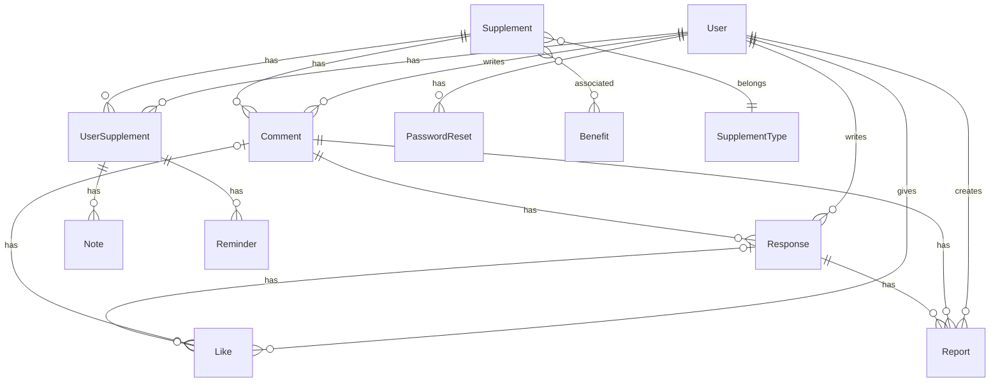

# Vitam-in

## Entity Relation 

```mermaid
erDiagram
    direction TB
    User ||--o{ UserSupplement: "has"
    User ||--o{ Comment : "writes"
    User ||--o{ Response : "writes"
    User ||--o{ Like : "gives"
    User ||--o{ Report : "creates"
    User ||--o{ PasswordReset : "has"
    
    Supplement ||--o{ UserSupplement : "has"
    Supplement }o--o{ Benefit : "associated"
    Supplement ||--o{ Comment : "has"
    Supplement }o--|| SupplementType : "belongs"

    UserSupplement ||--o{ Note : "has"
    UserSupplement ||--o{ Reminder : "has"


    Comment ||--o{ Response : "has"
    Comment |o--o{ Like : "has"
    Comment ||--o{ Report : "has"

    Response |o--o{ Like : "has"
    Response ||--o{ Report : "has"


```