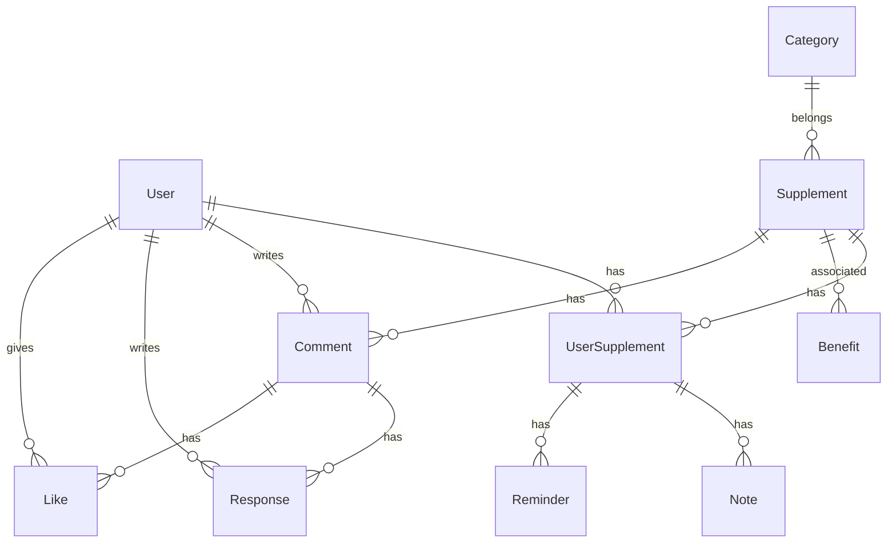

# Entity Relation 

```mermaid
erDiagram
    User ||--o{ UserSupplement: "has"
    Supplement ||--o{ UserSupplement : "has"
    UserSupplement ||--o{ Note : "has"
    UserSupplement ||--o{ Reminder : "has"
    Supplement ||--o{ Benefit : "associated"
    Category ||--o{ Supplement : "belongs"
    Supplement ||--o{ Comment : "has"
    User ||--o{ Comment : "writes"
    User ||--o{ Response : "writes"
    User ||--o{ Like : "gives"
    Comment ||--o{ Response : "has"
    Comment ||--o{ Like : "has"
```